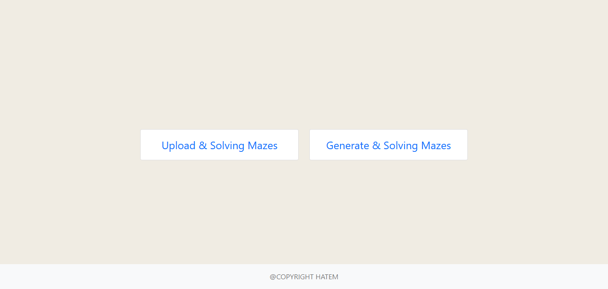
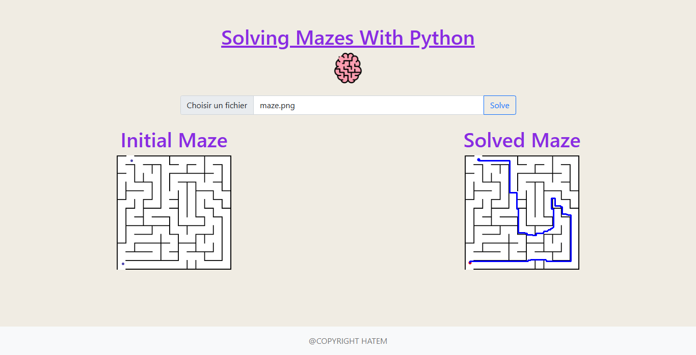
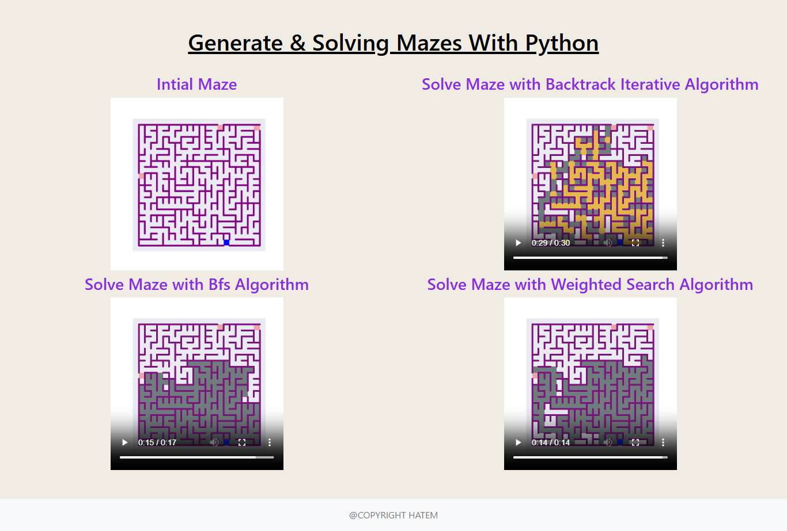

# Maze Generator & Solver

A web application that generates and solves mazes through multiple algorithms and supports image-based maze solving.

## Features

### Image-based Maze Solver

Transform any maze image into a solvable puzzle:
* Upload existing maze images and convert them into solvable formats
* Interactive point selection for start and end positions
* Automated path finding using Dijkstra's algorithm
* visualization of solution paths

### Maze Generator
Create and solve custom mazes with powerful algorithms:
* Automated maze generation
* Multiple solving algorithms:
  * Backtracking Iterative Search for depth-first exploration
  * Breadth First Search (BFS) for optimal path finding
* Visual feedback during generation and solving processes

## Visual Demonstrations

### Interface Overview

*The primary user interface

### Solution Workflows

#### Image-Based Solving

*Demonstration of Dijkstra's algorithm finding the optimal path*

#### Maze Generation and Solving

*Process of generating a new random maze & finding the shortest path through the generated maze*

## Technical Implementation

### Architecture

#### Frontend Stack
* Bootstrap 5.1.3 for responsive layouts
* jQuery for DOM manipulation and AJAX communications
* Vanilla JavaScript for core functionality

#### Backend Stack
* Django framework
* Python for algorithmic processing

### Core Components

#### Image Processing Module
* Handles maze image uploads
* Performs maze structure detection
* Implements Dijkstra's pathfinding

#### Maze Generation System
* Creates randomized maze structures
* Supports multiple solving algorithms:
  * Backtracking Iterative Search
  * Breadth First Search (BFS)
* Provides visual feedback during generation and solving

#### Interactive Features
* Dual-point marker system for start/end positions
* Coordinate tracking with precise offset calculations
* Visual feedback through styled markers
* Solution visualization

## Getting Started

### Prerequisites
* Python 3.x
* Django
* Node.js for package management

### Installation

1. Clone the repository:
```bash
git clone [repo-url]
```

2. Install Python dependencies:
```bash
pip install -r requirements.txt
```

3. Install frontend packages:
```bash
npm install
```

### Running the Application
```bash
python manage.py runserver
```

Visit `http://localhost:8000` to access the application.

---